# cocos2dx-dev
sample game collection for development of cocos2dx 2.x

- Build  
you need visual studio 2017  
download cocos2d-x library 2.2.6 and install : https://cocos2d-x.org/download  
download cocos2dx-dev source code(source code must be downloaded to cocos2d-x library folder)  
go to the sample project's proj.win32 folder. and execute sln file. and build. that's all.  

- Sample List
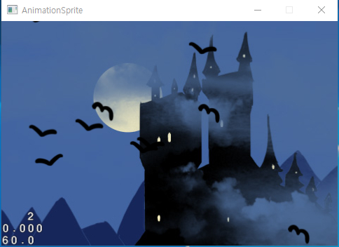
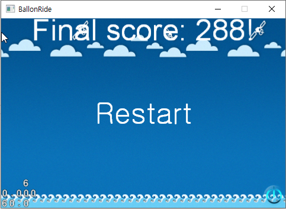
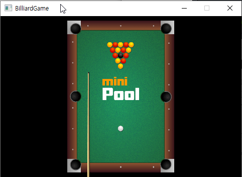
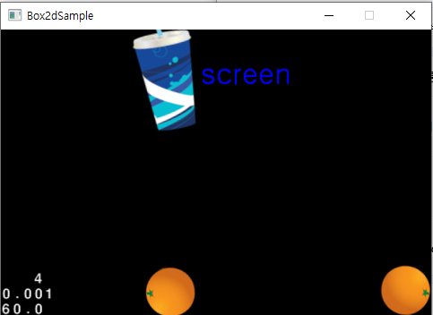
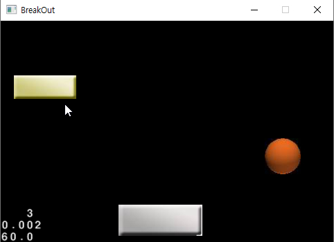
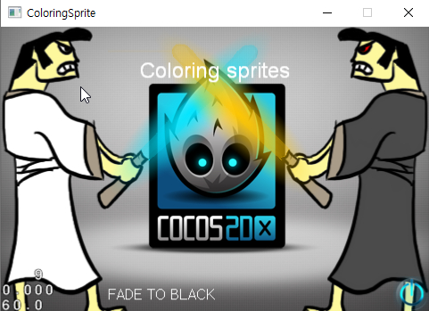
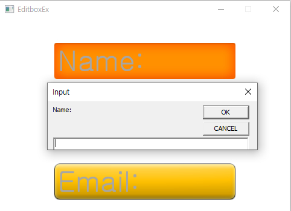
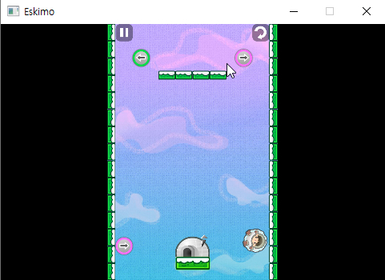
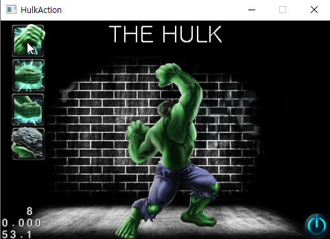
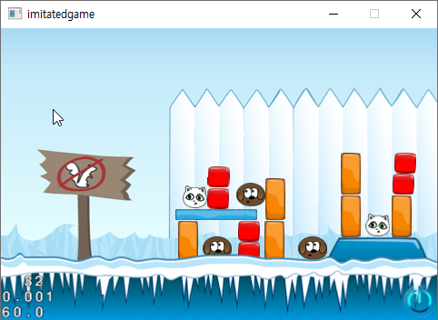
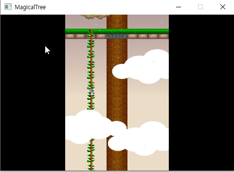
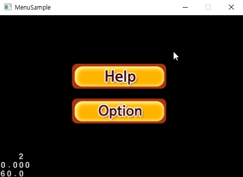
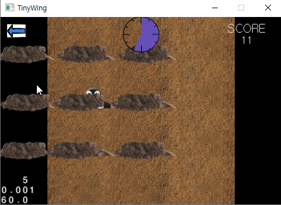
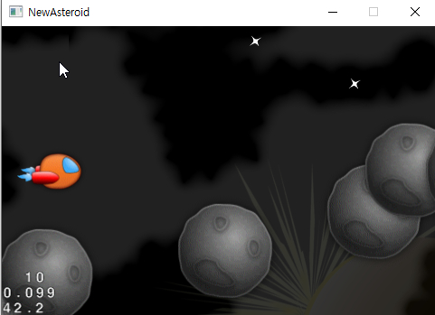
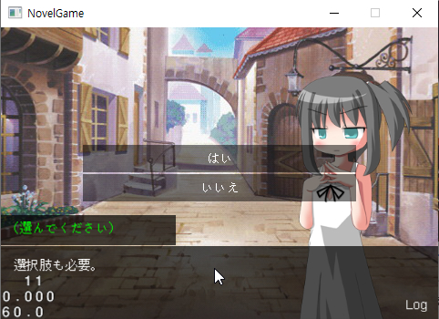
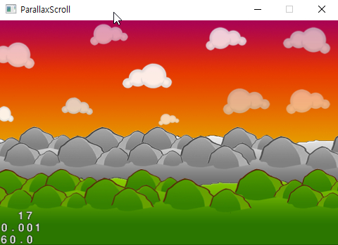
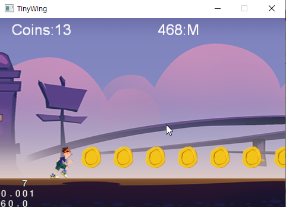
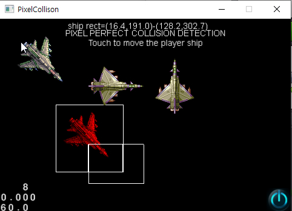
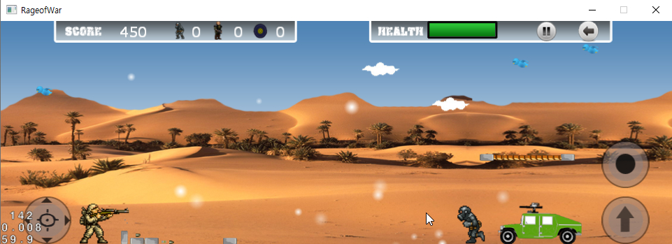
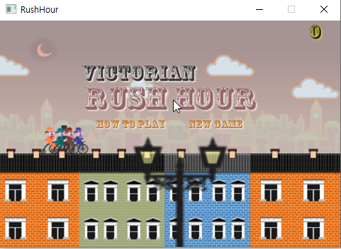
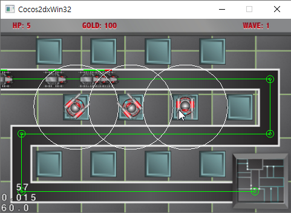
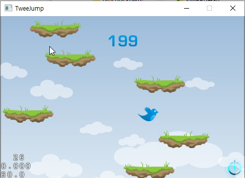
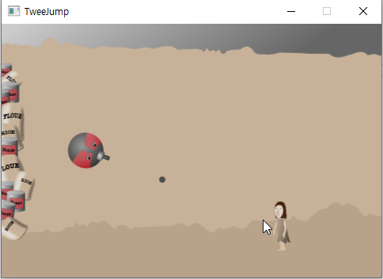
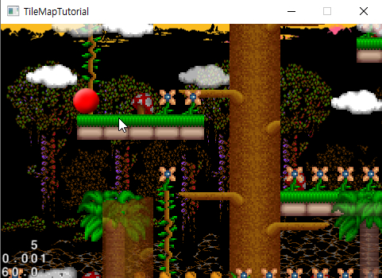
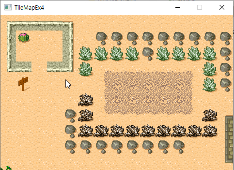
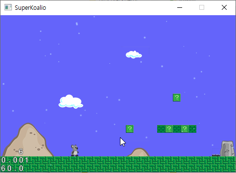
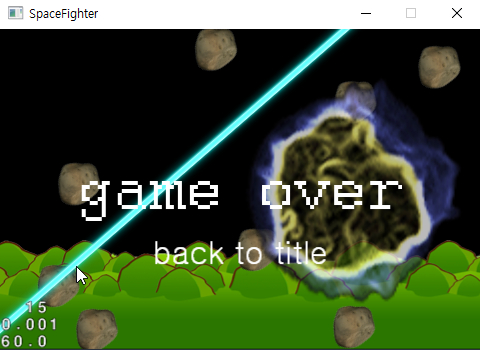
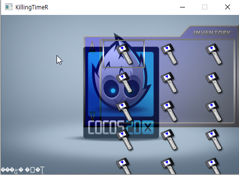
